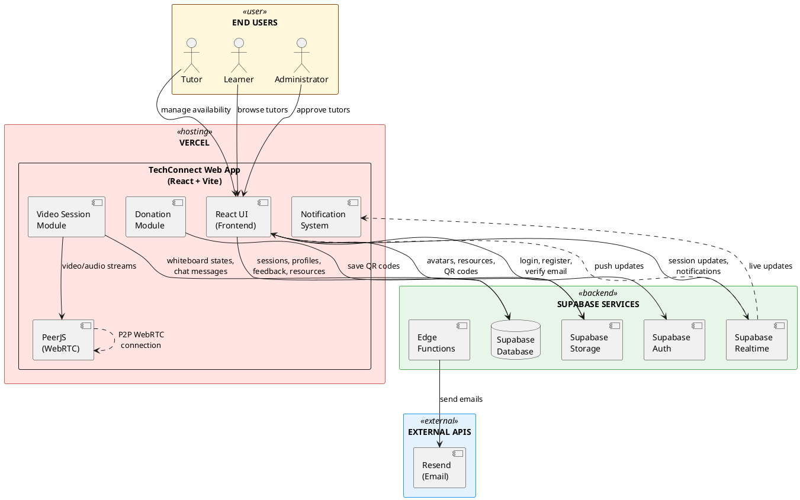

# TechConnect System Architecture Diagram

---

## Technology Stack

### Frontend
- **React 18** - UI framework
- **Vite** - Build tool
- **TypeScript** - Type safety
- **Tailwind CSS + shadcn/ui** - Styling
- **react-router-dom** - Routing
- **@tanstack/react-query** - Server state management
- **react-hook-form + zod** - Forms & validation
- **peerjs** - WebRTC video
- **fabric** - Whiteboard canvas
- **lucide-react** - Icons
- **sonner** - Toast notifications

### Backend (Supabase)
- **PostgreSQL** - Database
- **Supabase Auth** - Authentication
- **Supabase Storage** - File storage
- **Supabase Realtime** - Live updates
- **Edge Functions** - Serverless functions

### External Services
- **Resend** - Email delivery

### Database Tables
- `profiles` - User information
- `tutor_profiles` - Tutor details & availability
- `sessions` - Scheduled & instant sessions
- `feedback` - Ratings & reviews
- `resources` - Learning materials
- `notifications` - In-app notifications
- `whiteboard_states` - Collaborative whiteboard data
- `chat_messages` - In-session chat
