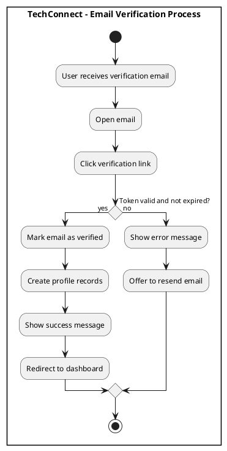
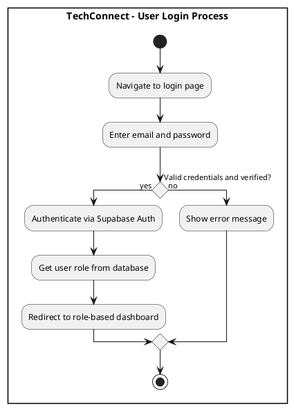
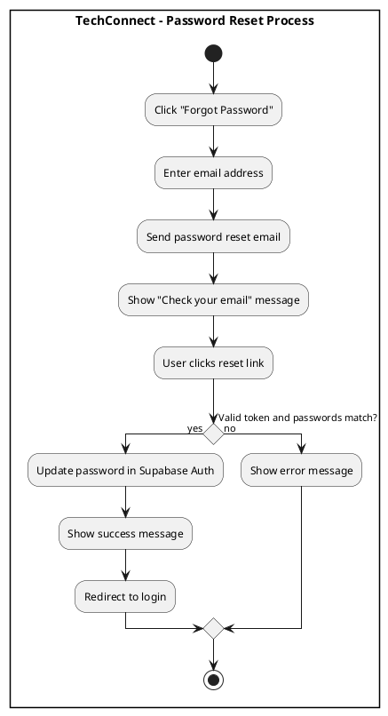
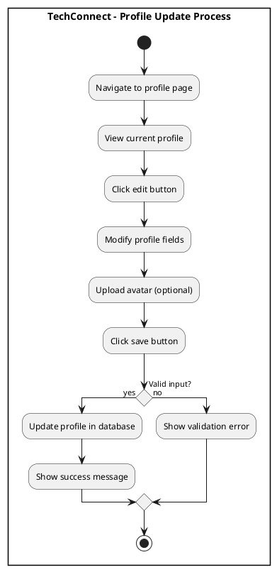
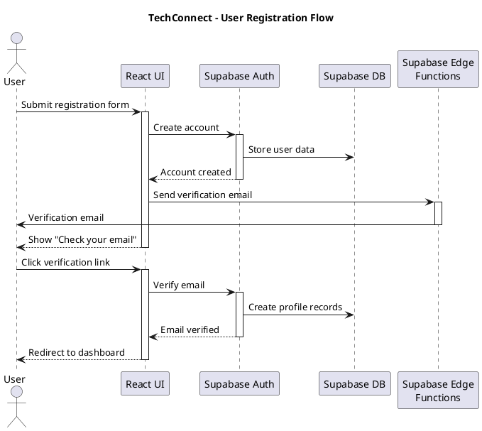
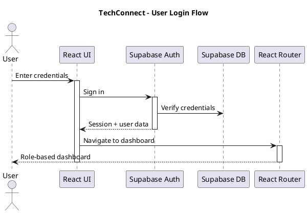
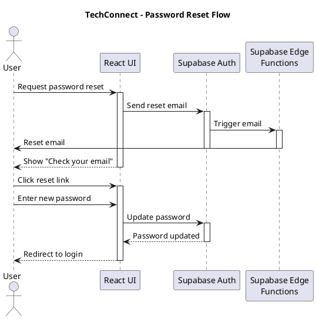
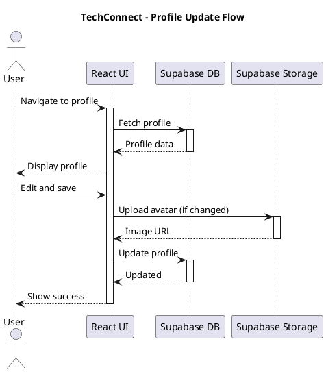
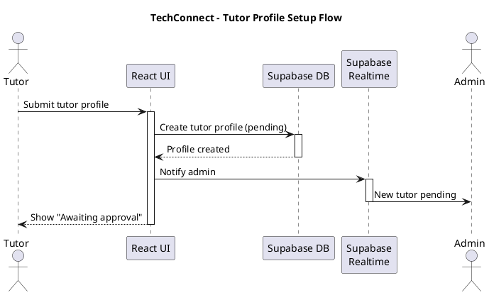

# Authentication & User Management Diagrams

## Activity Diagrams

### 1. User Registration

**Figure 1. User Registration Process**

This diagram shows how users register for TechConnect by selecting their role (Tutor or Learner), filling out the registration form with role-specific fields, and creating an account. The system validates input, creates the account via Supabase Auth, and sends a verification email.

  ```plantuml
  @startuml
  skinparam conditionStyle diamond

  rectangle "**TechConnect - User Registration Process**" {
  start
  :Navigate to role selection;
  :Choose role (Tutor/Learner);
  :Navigate to registration form;
  :Enter email, password, name;

  if (Role = Tutor?) then (yes)
    :Enter bio;
    :Select subject expertise;
    :Select registered year;
  else (no)
    :Select subjects of interest;
    :Select registered year;
  endif

  :Click register button;

  if (Valid input?) then (yes)
    :Create account via Supabase Auth;
    :Store metadata in auth.users;
    
    fork
      :Send verification email;
    fork again
      :Redirect to verification page;
    end fork
    
    :Show success message;
  else (no)
    :Show validation error;
  endif
  
  stop
  }

  @enduml
  ```

### 2. Email Verification

**Figure 2. Email Verification Process**

This diagram illustrates how users verify their email address by clicking the verification link sent to their inbox. The system validates the token, marks the email as verified, creates profile records, and redirects the user to their dashboard.



### 3. User Login

**Figure 3. User Login Process**

This diagram shows how users authenticate by entering their credentials. The system verifies the credentials and email verification status, retrieves the user's role from the database, and redirects them to their role-specific dashboard.



### 4. Password Reset

**Figure 4. Password Reset Process**

This diagram depicts how users reset their forgotten password by requesting a reset email, clicking the reset link, and entering a new password. The system validates the token and updates the password in Supabase Auth.



### 5. Profile Update

**Figure 5. Profile Update Process**

This diagram shows how users update their profile information by navigating to the profile page, editing fields, optionally uploading an avatar, and saving changes. The system validates input and updates the profile in the database.



---

## Sequence Diagrams

### 1. User Registration

**Figure 6. User Registration Flow**

This sequence diagram describes the technical interactions during user registration. It shows how the React UI communicates with Supabase Auth to create an account, triggers the Edge Function to send a verification email, and handles the email verification process when the user clicks the link.



### 2. User Login

**Figure 7. User Login Flow**

This sequence diagram illustrates how the system authenticates users by verifying credentials through Supabase Auth, retrieving user data from the database, and using React Router to navigate to the appropriate role-based dashboard.



### 3. Password Reset

**Figure 8. Password Reset Flow**

This sequence diagram shows the password reset process, including how the system sends a reset email via Edge Functions, handles the user clicking the reset link, and updates the password in Supabase Auth.



### 4. Profile Update

**Figure 9. Profile Update Flow**

This sequence diagram describes how users update their profile, including fetching current profile data, uploading a new avatar to Supabase Storage if changed, and updating profile information in the database.



### 5. Tutor Profile Setup

**Figure 10. Tutor Profile Setup Flow**

This sequence diagram shows how tutors complete their profile setup by submitting tutor-specific information. The system creates a pending tutor profile and uses Supabase Realtime to notify admins of the new tutor awaiting approval.



---

**Total Diagrams in this file: 10 (5 Activity + 5 Sequence)**
