# Session Management Diagrams

## Activity Diagrams

### 1. Request Scheduled Session

**Figure 11. Request Scheduled Session Process**

This diagram shows how learners request a scheduled tutoring session by selecting a tutor, choosing a date, time, and subject. The system validates the booking, creates the session request, and notifies the tutor via in-app notification and email.

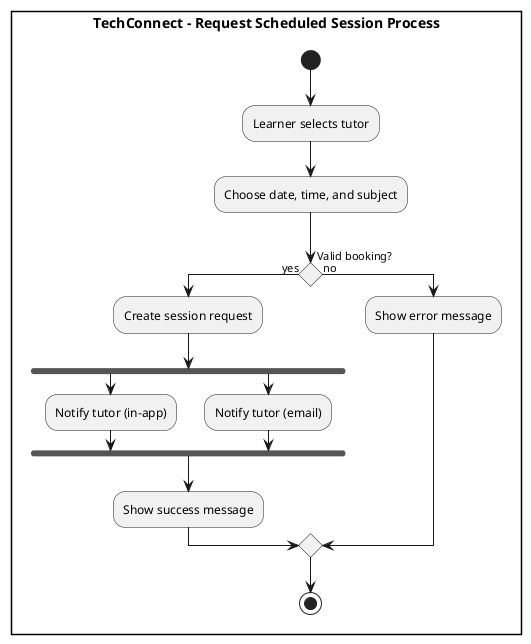

###  Request Instant Session

**Figure 12. Request Instant Session Process** - Learners request instant sessions, system broadcasts to online tutors.

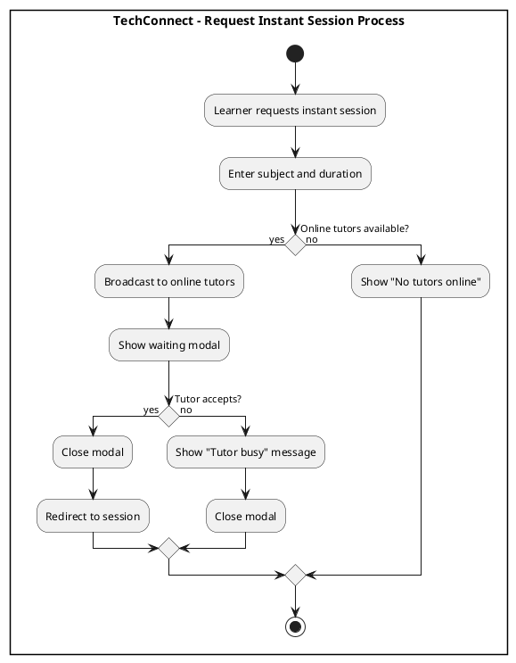

###  Accept Session Request

**Figure 13. Accept Session Request Process**

This diagram shows how tutors accept incoming session requests by reviewing the request details and confirming acceptance. The system updates the session status to accepted and notifies the learner.

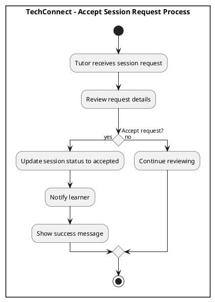

###  Decline Session Request

**Figure 14. Decline Session Request Process**

This diagram depicts how tutors decline session requests by clicking the decline button, providing a reason in the dialog, and confirming the declination. The system updates the session status and notifies the learner with the declination reason.

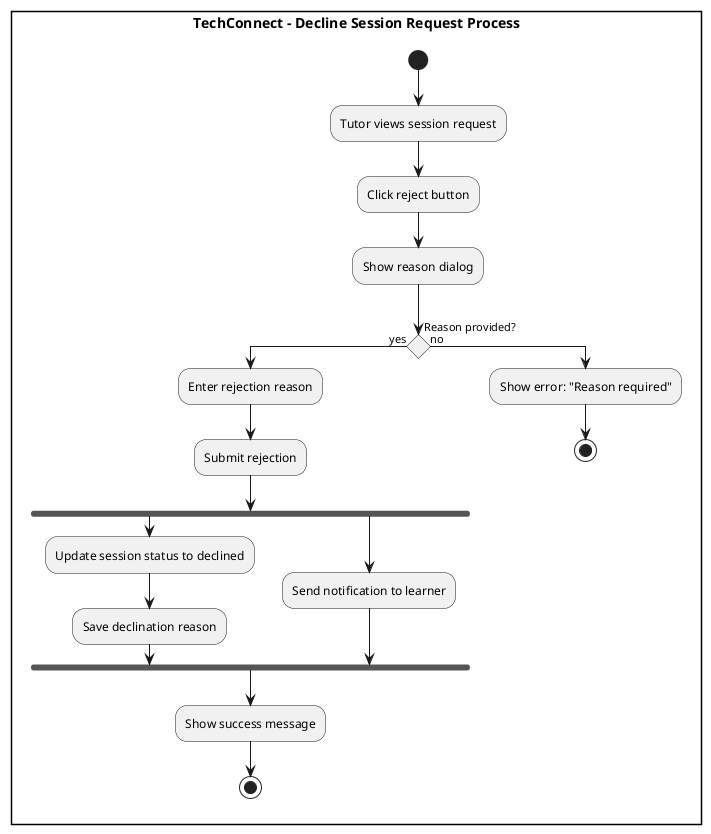

###  Reschedule Session

**Figure 16. Reschedule Session Process** - Learners reschedule sessions, tutors approve new time.

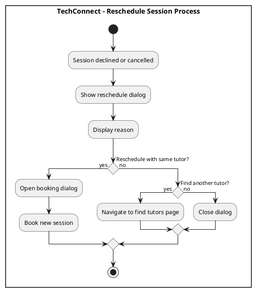

###  Cancel Session (Learner)

**Figure 15. Cancel Session Process (Learner)** - Learners cancel sessions with reason, system notifies tutor.

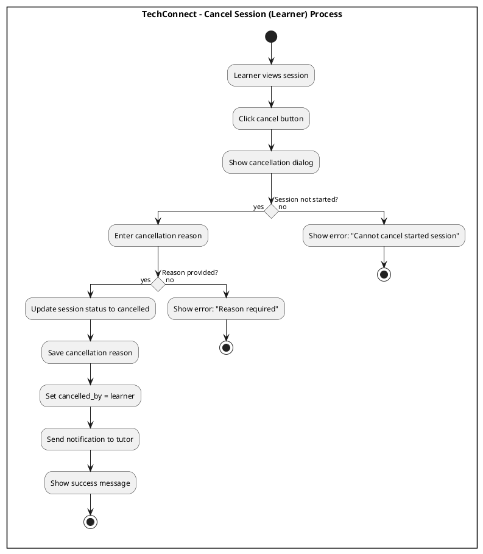

###  Cancel Session (Tutor)

**Figure 15b. Cancel Session Process (Tutor)** - Tutors cancel sessions with reason, system notifies learner.


###  Mark Session Completed

  ```plantuml
  @startuml
  skinparam conditionStyle diamond

  rectangle "**TechConnect - Mark Session Completed Process**" {
  start
  :Session ends;

  fork
    :Tutor: Enter topics covered (required);
    :Save session log;
  fork again
    :Learner: Show feedback modal;
    :Enter topics covered (required);
    :Select rating (required);
    
    if (Tutor has QR code?) then (yes)
      :Show donation option (optional);
    else (no)
      :Skip donation;
    endif
    
    :Submit feedback;
  end fork

  :Update session status to completed;

  stop

  @enduml
  ```

###  Auto-Mark Missed Session

**Figure 19. Mark Session as Missed Process** - System automatically marks sessions as missed when no one joins.

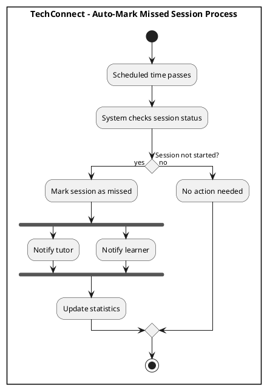

###  View Session History

**Figure 17. View Session History Process** - Users view past sessions with filters and details.

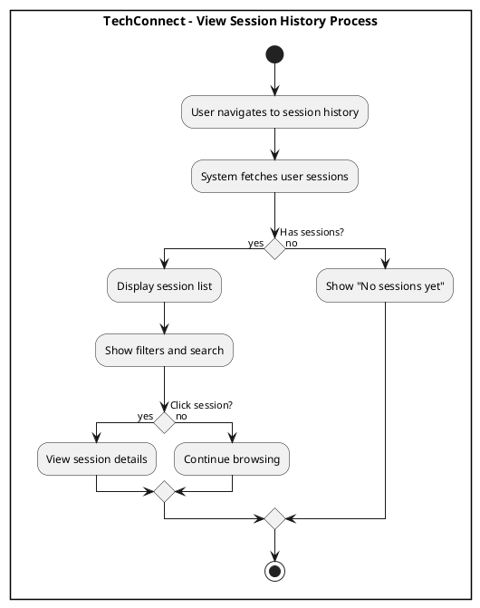

---

## Sequence Diagrams

### 1. Request Scheduled Session

**Figure 21. Request Scheduled Session Flow** - Technical flow for creating scheduled session requests.

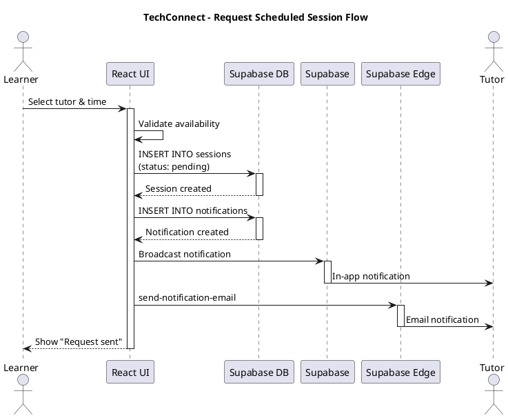

###  Request Instant Session

**Figure 22. Request Instant Session Flow** - Technical flow for instant session broadcasting and acceptance.

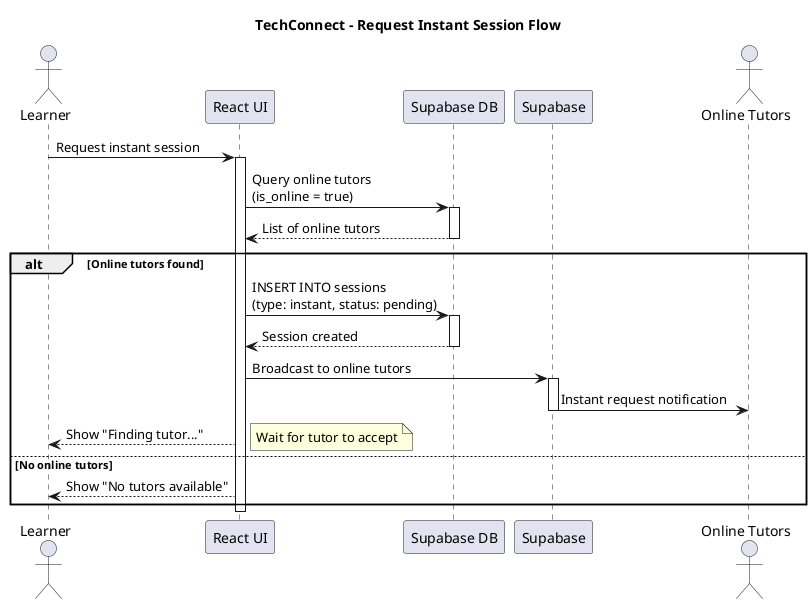

### 3. Accept Session Request

**Figure 23. Accept Session Request Flow** - Technical flow for tutors accepting session requests.

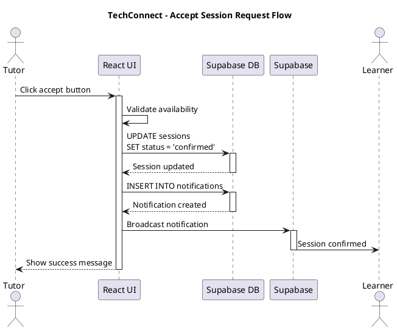

### 4. Decline Session Request

**Figure 24. Decline Session Request Flow** - Technical flow for tutors declining sessions with reasons.

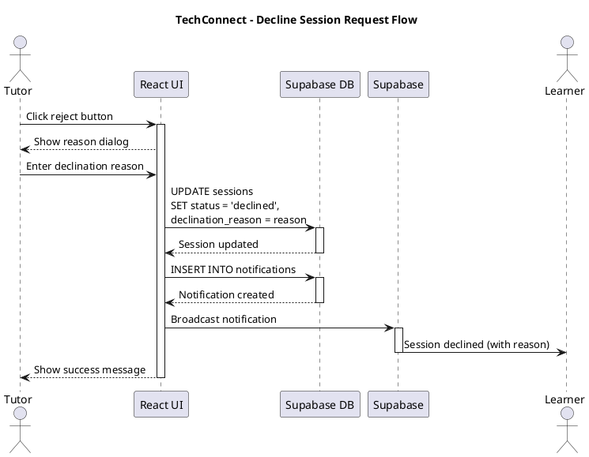

### 5. Reschedule Session

**Figure 26. Reschedule Session Flow** - Technical flow for rescheduling and tutor approval.

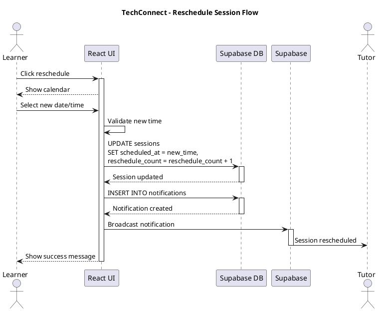

### 6. Cancel Session (Learner)

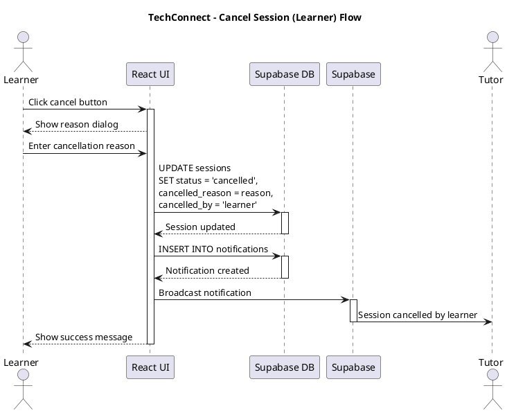

### 7. Cancel Session (Tutor)


### 8. Mark Session Completed

**Figure 28. Mark Session as Completed Flow** - Technical flow for automatic session completion.

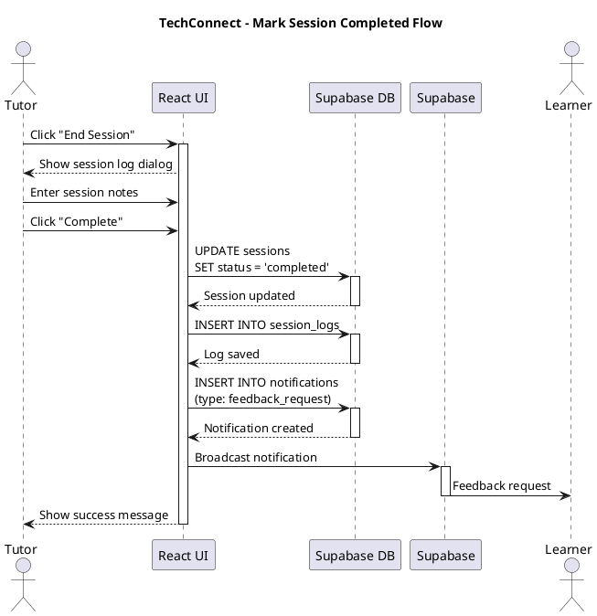

### 9. Auto-Mark Missed Session

**Figure 29. Mark Session as Missed Flow** - Technical flow for detecting and marking missed sessions.

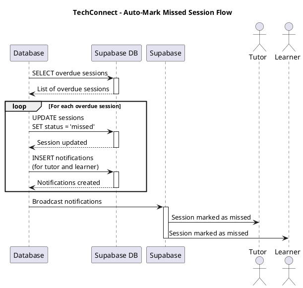

### 10. View Session History

**Figure 30. View Session Details Flow** - Technical flow for fetching a
@startuml

title TechConnect - View Session History Flow

actor User
participant "React UI" as React
participant "Supabase DB" as DB

User -> React: Navigate to session history
activate React
React -> DB: SELECT sessions\nWHERE user_id = current_user\nORDER BY scheduled_at DESC
activate DB
DB --> React: Session list
deactivate DB

React --> User: Display sessions

User -> React: Apply filters
React -> DB: SELECT with filters
activate DB
DB --> React: Filtered sessions
deactivate DB

React --> User: Display filtered sessions
deactivate React

@enduml
```

---

**Total Diagrams in this file: 20 (10 Activity + 10 Sequence)**
