# Video Session Diagrams

## Activity Diagrams

### 1. Join Session (Learner)

**Figure 31. Join Video Session Process (Learner)** - Learners test devices, enter waiting room, get admitted by tutor.

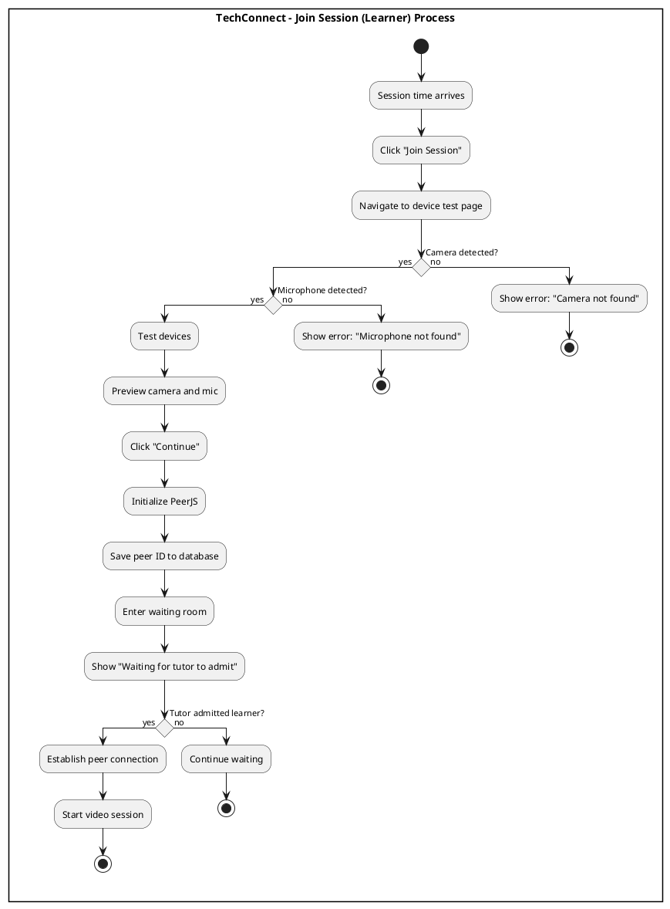

###  Join Session (Tutor)

**Figure 31b. Join Video Session Process (Tutor)** - Tutors test devices, join session, admit learner from waiting room.

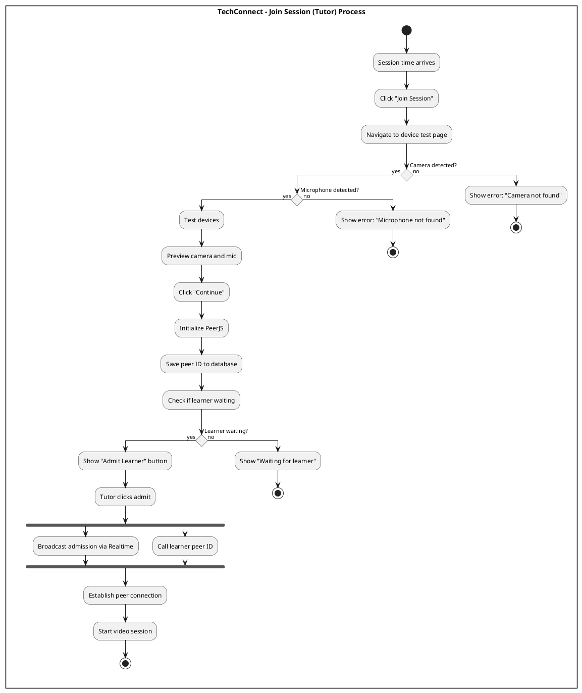

###  Use Whiteboard

**Figure 33. Use Whiteboard Process** - Users draw on collaborative whiteboard with real-time sync.

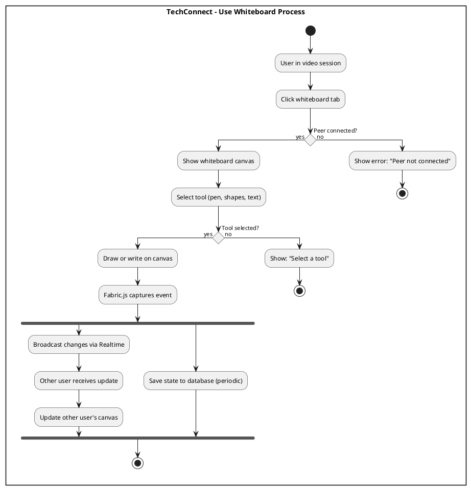

###  Share Files in Session

**Figure 35. Upload Session Asset Process** - Users upload files during sessions, stored in Supabase Storage.

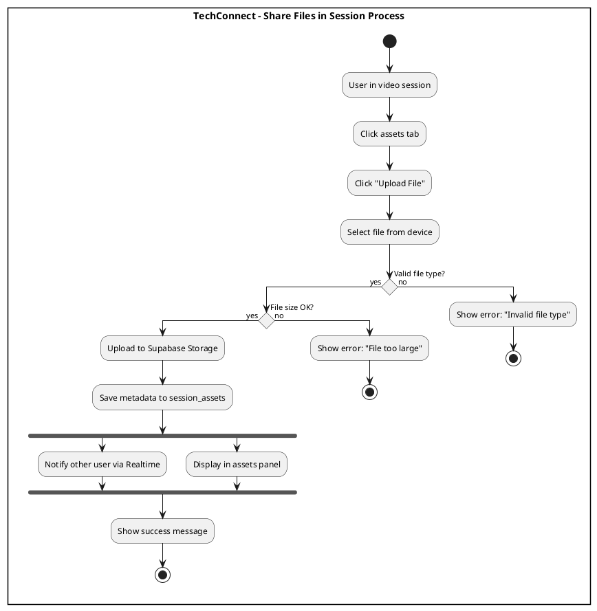

###  Use In-Session Chat

**Figure 34. Send Chat Message Process** - Users send chat messages with real-time delivery.

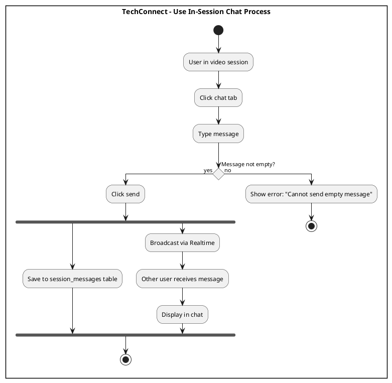

###  Screen Share

**Figure 32. Share Screen Process** - Users share their screen, broadcast to other participant.

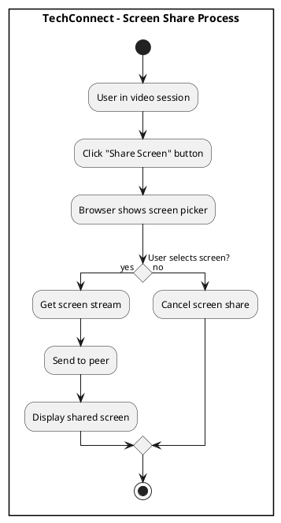

###  End Session

**Figure 36. End Video Session Process** - Users end session, disconnect, learner provides feedback.

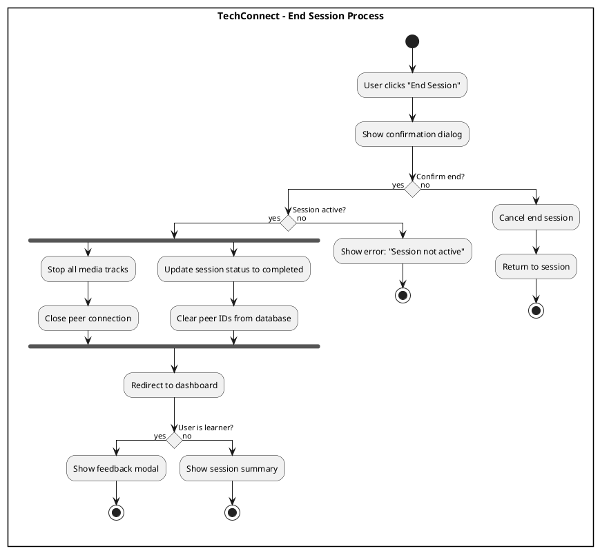

###  Device Testing

**Figure 37. Handle Connection Issues Process** - System tests devices before joining session.

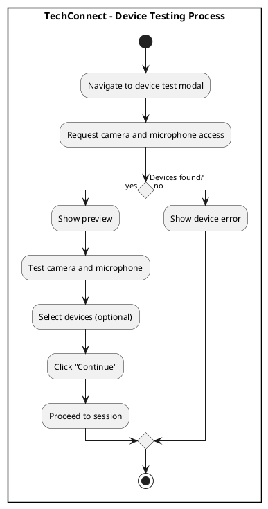

---

## Sequence Diagrams

### 1. Join Session (Learner)

**Figure 39. Join Video Session Flow (Learner)** - Technical flow for learner joining with device test and waiting room.

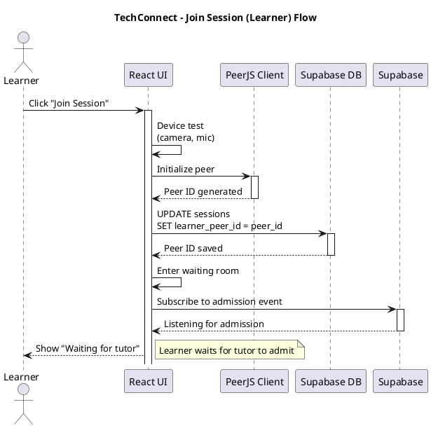

###  Join Session (Tutor)

**Figure 39b. Join Video Session Flow (Tutor)** - Technical flow for tutor joining and admitting learner.

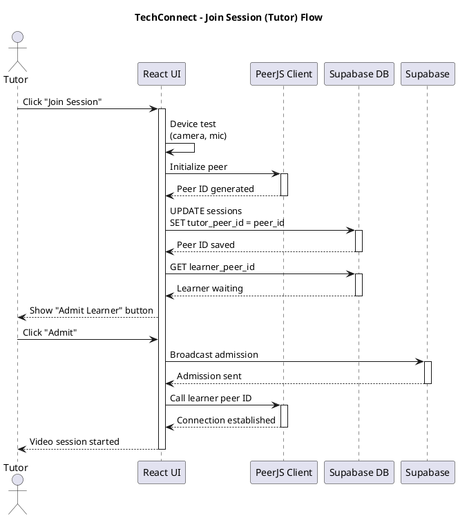

###  Establish Video Connection

**Figure 40. Share Screen Flow** - Technical flow for establishing peer-to-peer video connections.

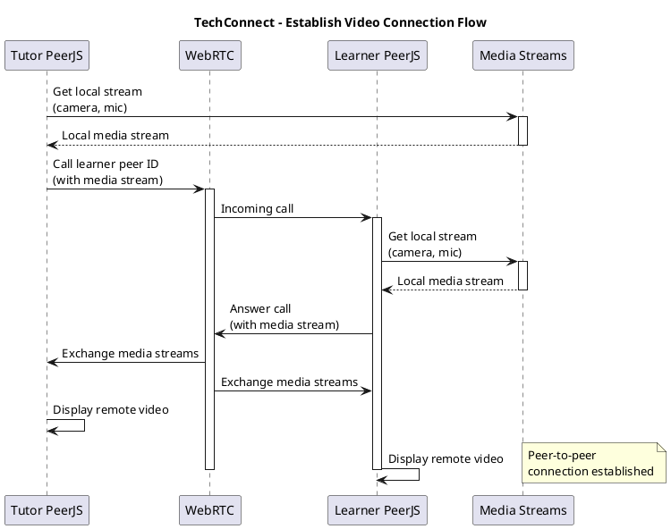

###  Whiteboard Sync

**Figure 41. Use Whiteboard Flow** - Technical flow for real-time whiteboard synchronization.

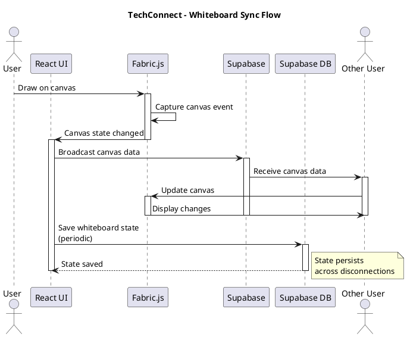

###  Send Chat Message

**Figure 42. Send Chat Message Flow** - Technical flow for sending and receiving chat messages.

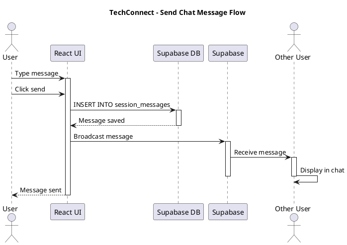

###  Share File in Session

**Figure 43. Upload Session Asset Flow** - Technical flow for uploading and sharing files during sessions.

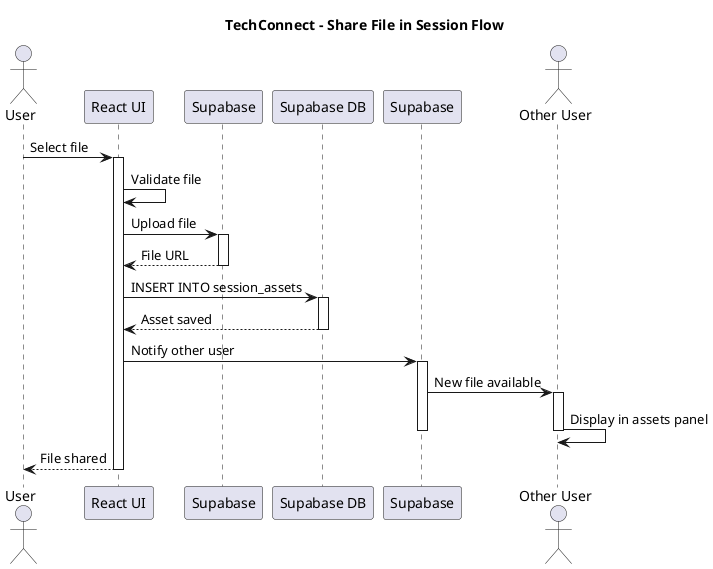

###  Screen Share

**Figure 44. Screen Share Flow** - Technical flow for capturing and broadcasting screen share.

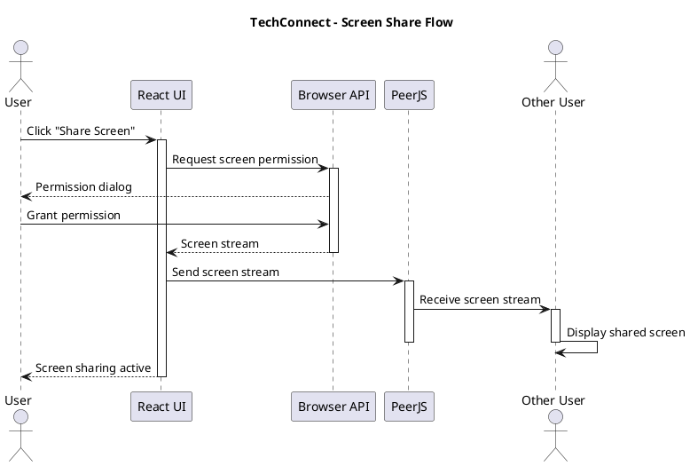

###  End Session

**Figure 45. End Video Session Flow** - Technical flow for ending sessions and triggering feedback.

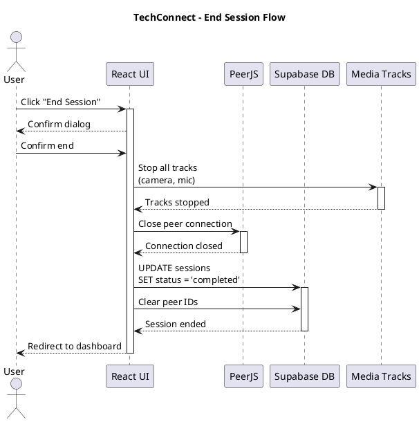

---

**Total Diagrams in this file: 16 (8 Activity + 8 Sequence)**
