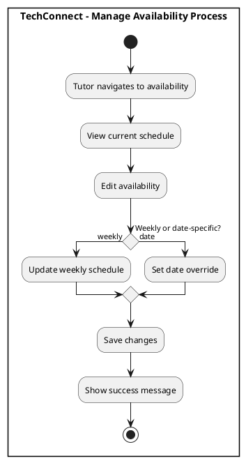
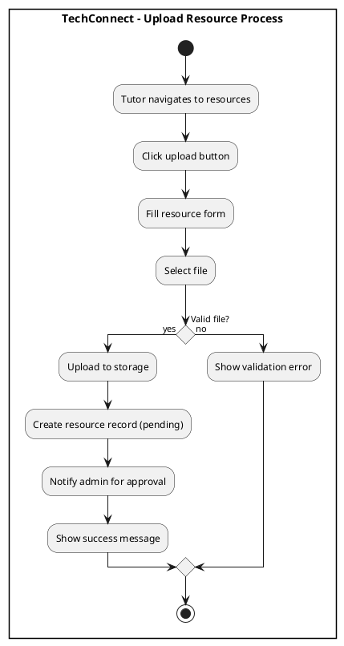
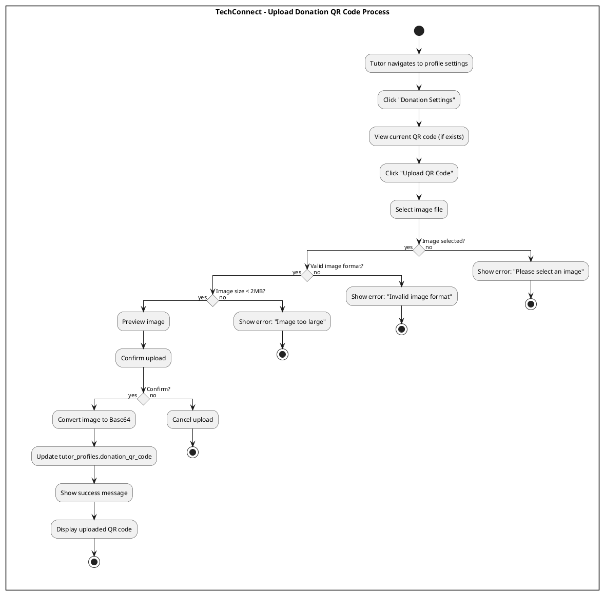
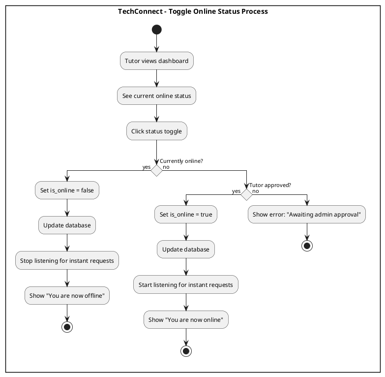
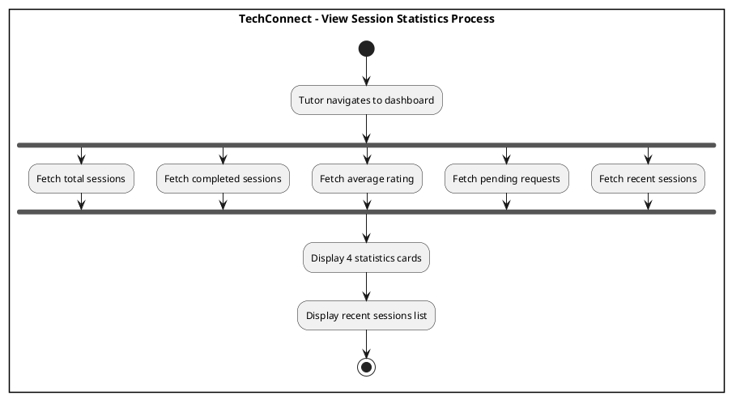
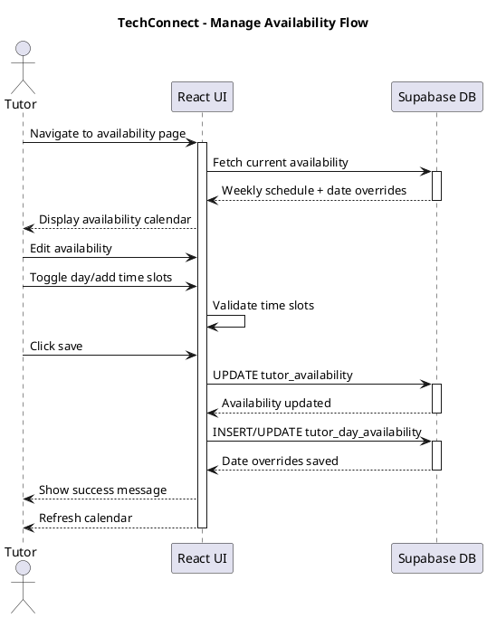
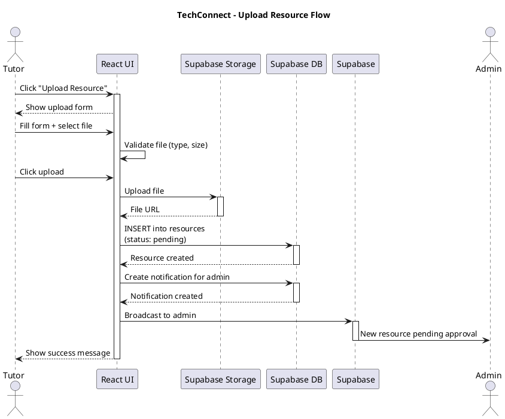
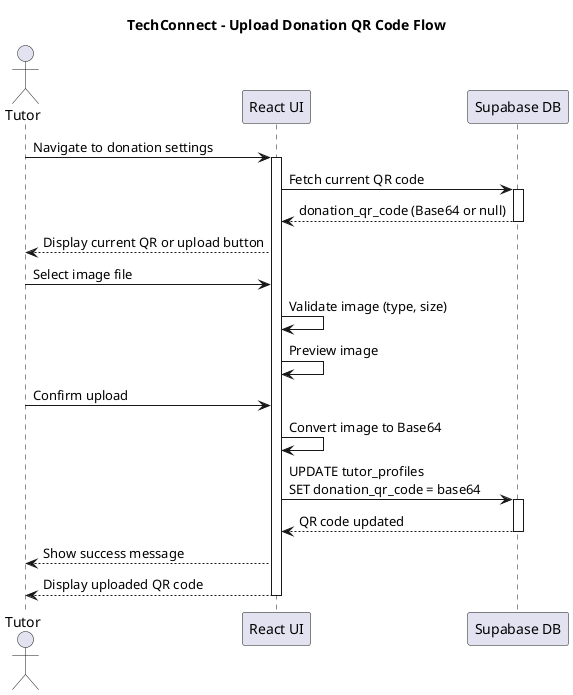
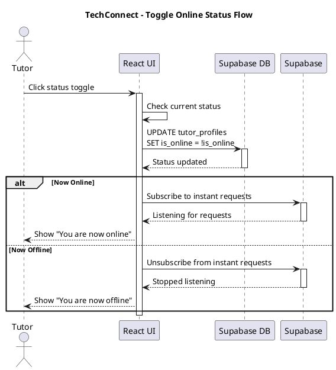
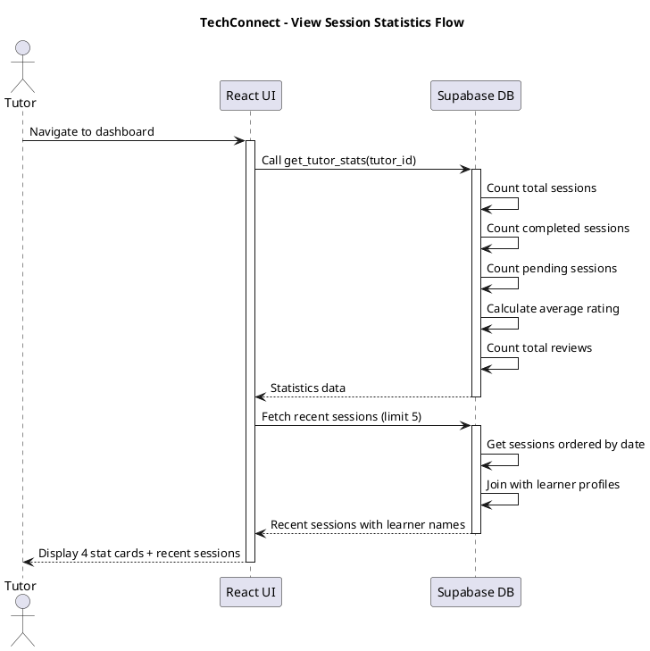

# Tutor Features Diagrams

## Activity Diagrams

### 1. Manage Availability

**Figure 47. Manage Availability Process** - Tutors set weekly schedule and date-specific availability.

###  Upload Resource

**Figure 48. Upload Resource Process** - Tutors upload educational resources for admin approval.

###  Upload Donation QR Code

**Figure 49. Upload Donation QR Code Process** - Tutors upload donation QR codes for learner tips.

###  Toggle Online Status

**Figure 50. Toggle Online Status Process** - Tutors toggle availability for instant sessions.

###  View Session Statistics

**Figure 51. View Session Statistics Process** - Tutors view dashboard with session stats and ratings.

---

## Sequence Diagrams

### 1. Manage Availability

**Figure 52. Manage Availability Flow** - Technical flow for updating tutor availability schedules.

###  Upload Resource

**Figure 53. Upload Resource Flow** - Technical flow for uploading resources and notifying admins.

###  Upload Donation QR Code

**Figure 54. Upload Donation QR Code Flow** - Technical flow for uploading and storing QR codes.

###  Toggle Online Status

**Figure 55. Toggle Online Status Flow** - Technical flow for toggling online status and instant session availability.

###  View Session Statistics

**Figure 56. View Session Statistics Flow** - Technical flow for fetching and displaying tutor statistics.

---

**Total Diagrams in this file: 10 (5 Activity + 5 Sequence)**
