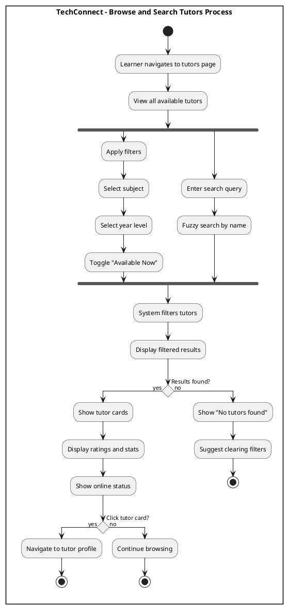
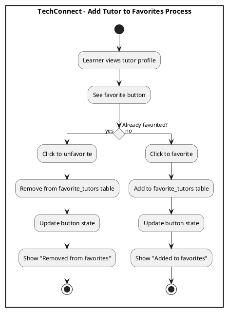
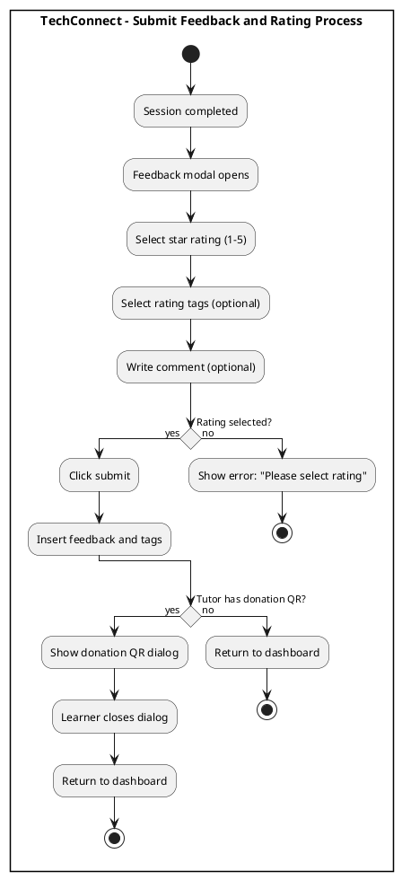
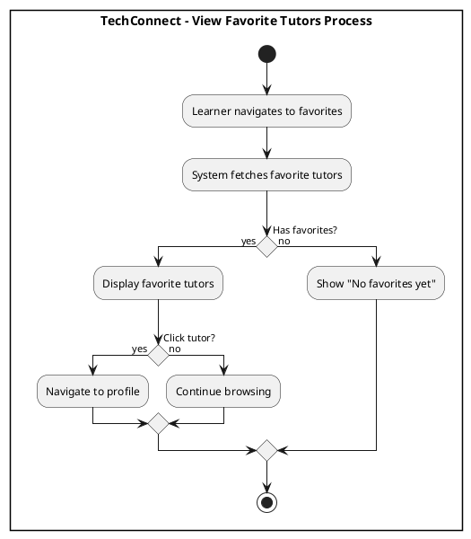
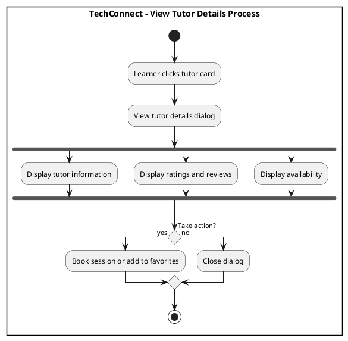
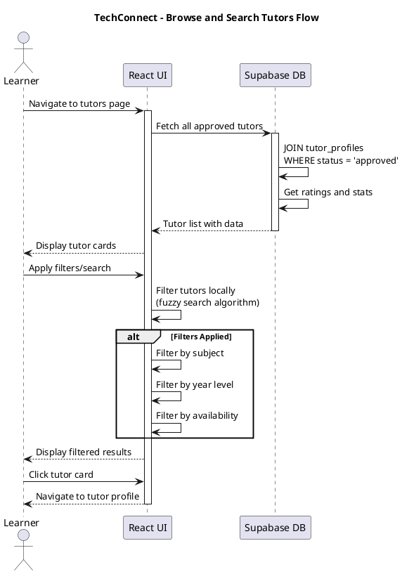
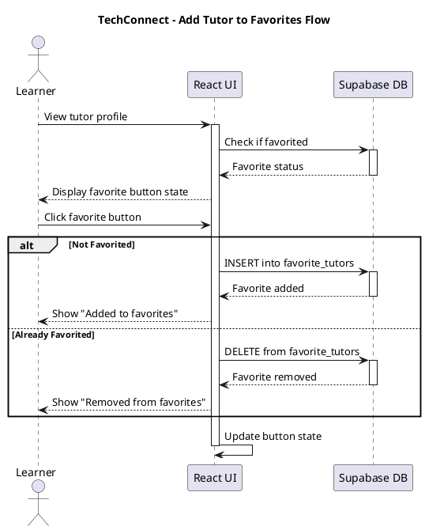
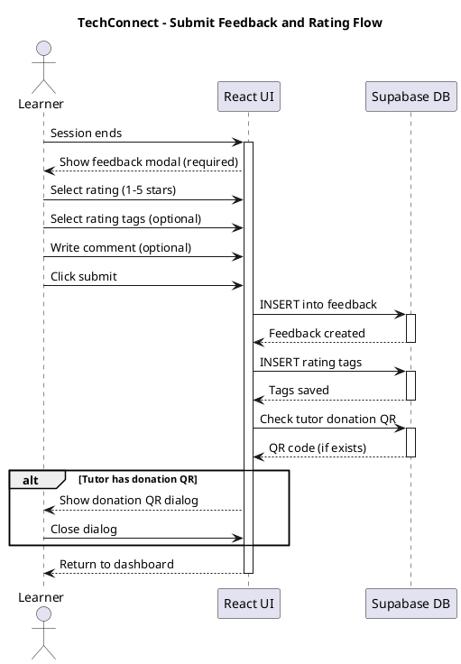
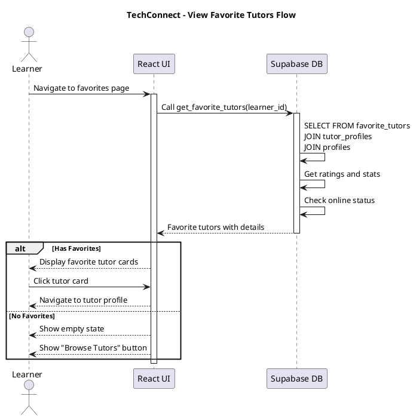
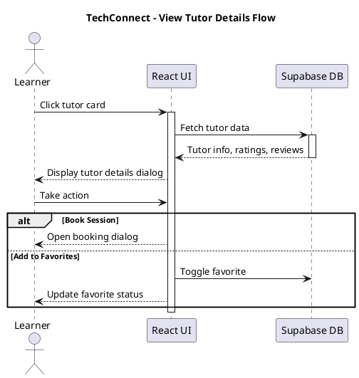

# Learner Features Diagrams

## Activity Diagrams

### 1. Browse and Search Tutors

###  Add Tutor to Favorites

**Figure 58. Add Tutor to Favorites Process** - Learners add/remove tutors from favorites list.

###  Submit Feedback and Rating

**Figure 59. Submit Feedback and Rating Process** - Learners rate sessions with stars, tags, and comments.

###  View Favorite Tutors

**Figure 60. View Favorite Tutors Process** - Learners view their saved favorite tutors list.

###  View Tutor Profile

**Figure 61. View Tutor Profile Process** - Learners view detailed tutor information and ratings.

---

## Sequence Diagrams

### 1. Browse and Search Tutors

**Figure 62. Browse and Search Tutors Flow** - Technical flow for fetching and filtering tutors.

###  Add Tutor to Favorites

**Figure 63. Add Tutor to Favorites Flow** - Technical flow for toggling favorite status.

###  Submit Feedback and Rating

**Figure 64. Submit Feedback and Rating Flow** - Technical flow for submitting feedback with optional donation QR.

###  View Favorite Tutors

**Figure 65. View Favorite Tutors Flow** - Technical flow for retrieving favorite tutors with details.

###  View Tutor Details

**Figure 66. View Tutor Profile Flow** - Technical flow for fetching comprehensive tutor information.

---

**Total Diagrams in this file: 10 (5 Activity + 5 Sequence)**
