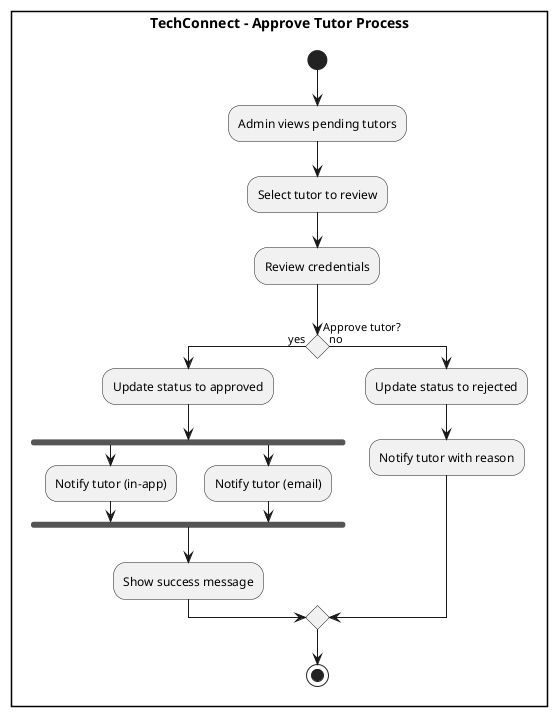
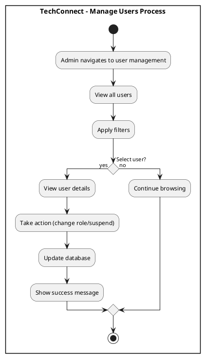
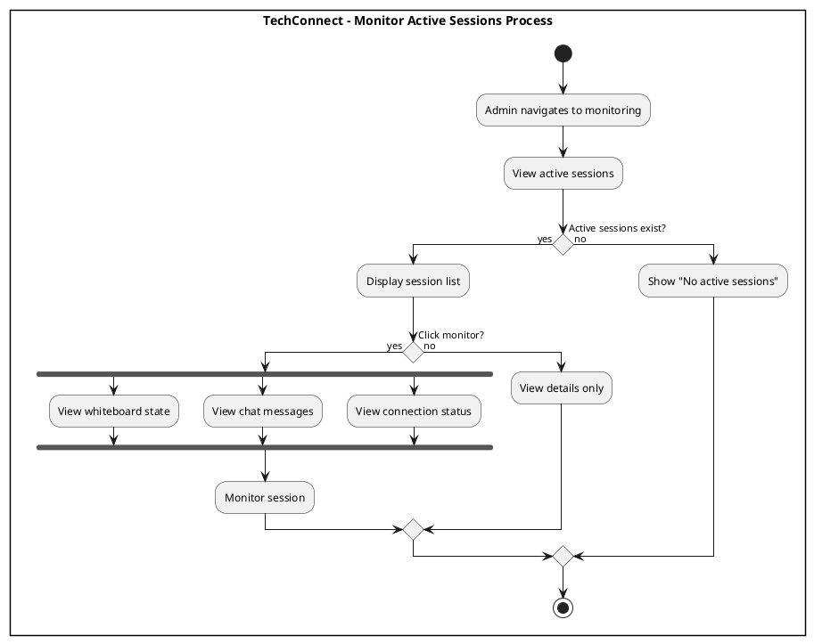
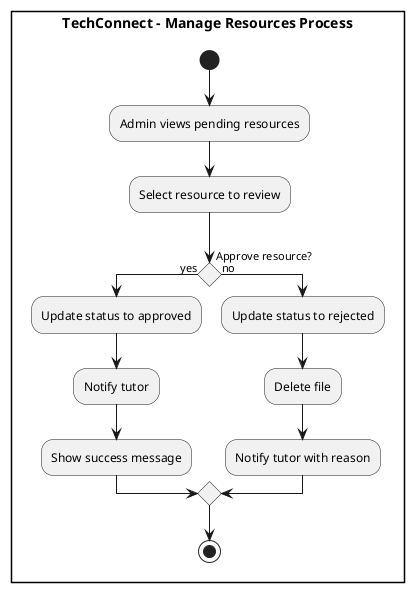
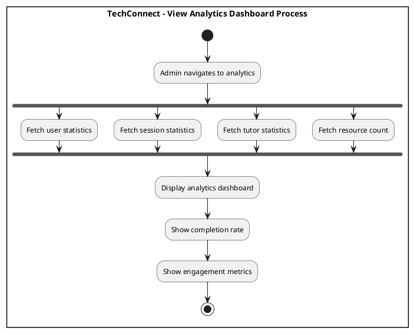
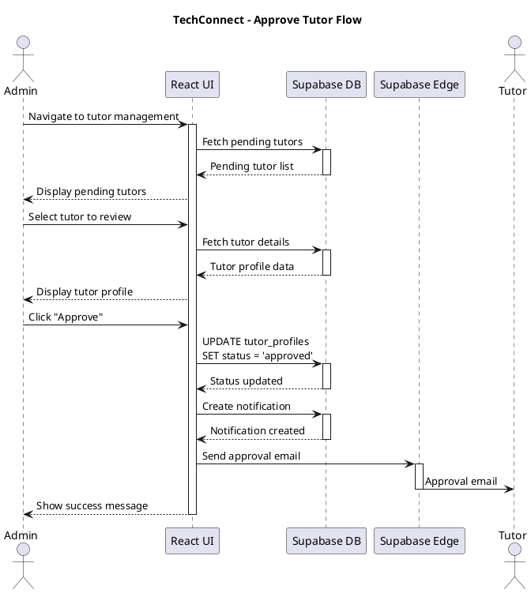
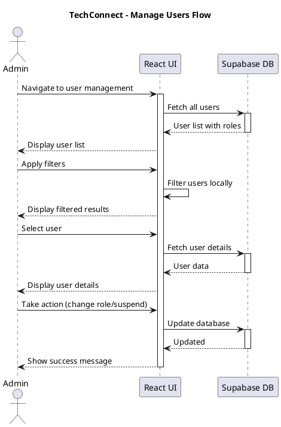
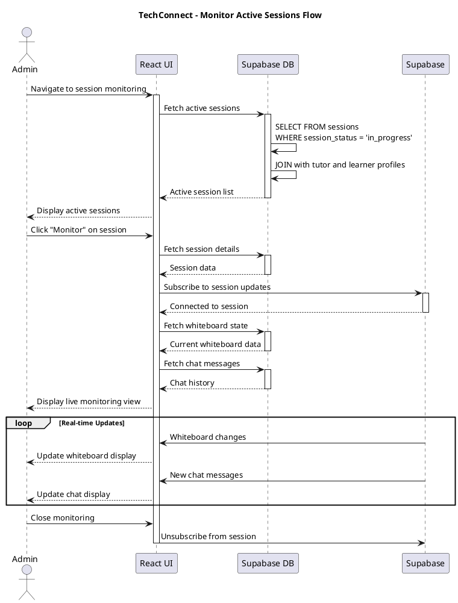
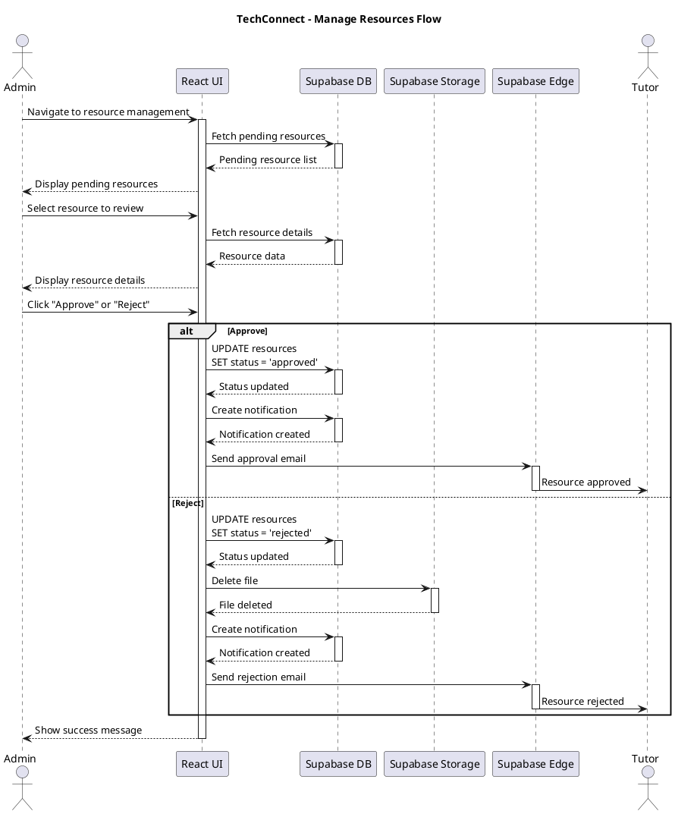
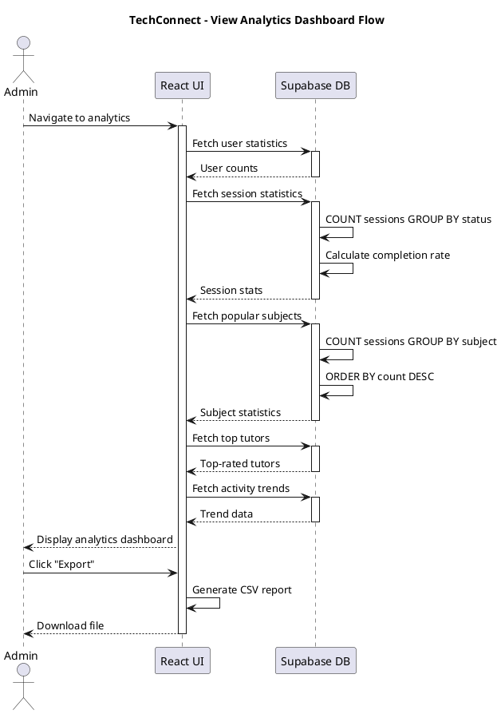

# Admin Features Diagrams

## Activity Diagrams

### 1. Approve Tutor

**Figure 67. Approve Tutor Process** - Admins review and approve/reject tutor applications.

###  Manage Users

**Figure 68. Manage Users Process** - Admins manage user accounts, change roles, suspend users.

###  Monitor Active Sessions

**Figure 69. Monitor Active Sessions Process** - Admins monitor live sessions in real-time.

###  Manage Resources

**Figure 70. Manage Resources Process** - Admins approve or reject tutor-uploaded resources.

###  View Analytics Dashboard

**Figure 71. View Analytics Dashboard Process** - Admins view system statistics and analytics.

---

## Sequence Diagrams

### 1. Approve Tutor

**Figure 72. Approve Tutor Flow** - Technical flow for approving tutors with notifications.

###  Manage Users

**Figure 73. Manage Users Flow** - Technical flow for managing user accounts and roles.

###  Monitor Active Sessions

**Figure 74. Monitor Active Sessions Flow** - Technical flow for real-time session monitoring.

###  Manage Resources

**Figure 75. Manage Resources Flow** - Technical flow for approving/rejecting resources.

###  View Analytics Dashboard

**Figure 76. View Analytics Dashboard Flow** - Technical flow for fetching system analytics.

---

**Total Diagrams in this file: 10 (5 Activity + 5 Sequence)**
