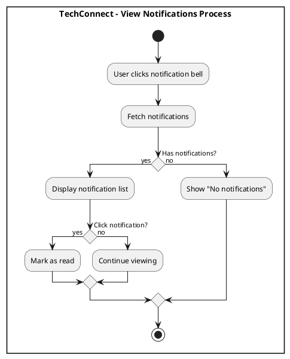
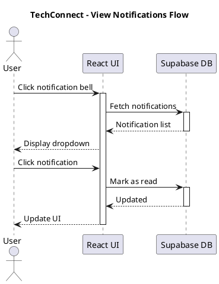

# Notification System Diagrams

## Activity Diagrams

### 1. View Notifications

**Figure 77. View Notifications Process** - Users view and mark notifications as read.

---

## Sequence Diagrams

### 1. View Notifications

**Figure 78. View Notifications Flow** - Technical flow for fetching and displaying notifications.

---

**Total Diagrams in this file: 2 (1 Activity + 1 Sequence)**
