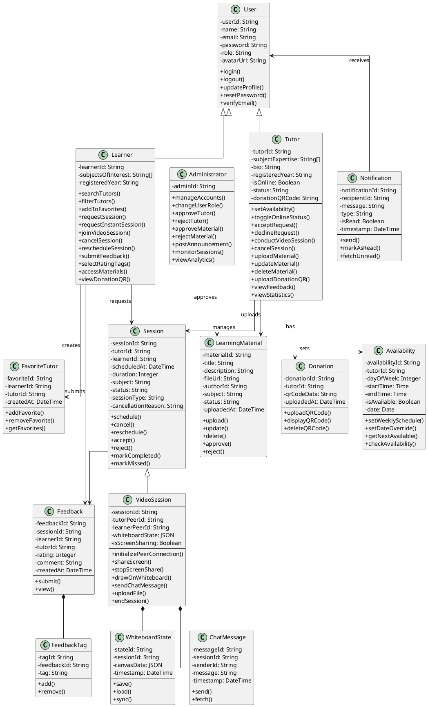
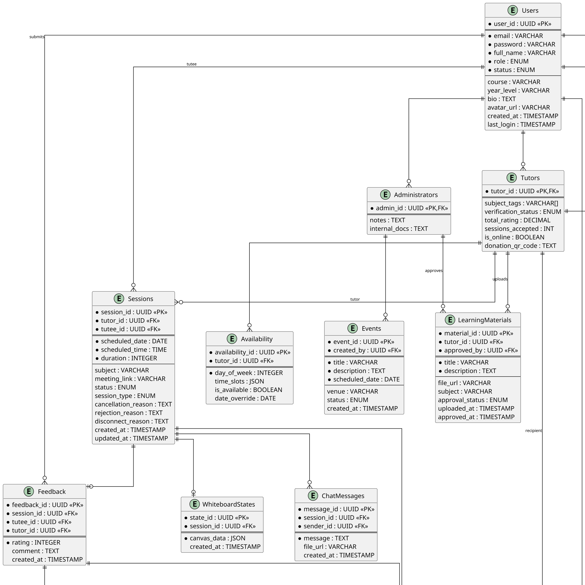
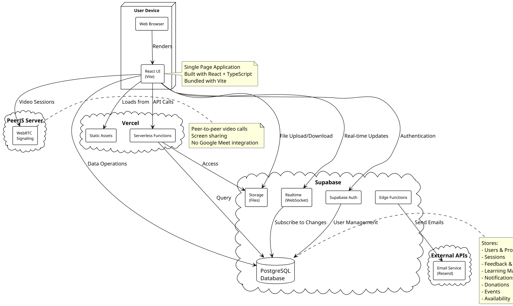

# TechConnect Class Diagram

---

**Figure 42. TechConnect Class Diagram**

This class diagram illustrates the object-oriented structure of the TechConnect platform, showing classes, their attributes and methods, and the relationships between them. The diagram demonstrates inheritance through the User base class, composition through VideoSession extending Session, and various associations representing how users interact with system components.

---

## Entity Relationship Diagram

---

**Figure 43. Entity Relationship Diagram**

The Users table serves as the foundation of the TechConnect system, supporting user authentication, profile management, and role-based access control. It securely manages user credentials through email–password combinations with encrypted password storage, while the role attribute distinguishes between Tutee, Tutor, and Administrator. The table includes personal information such as full name, contact details, and academic profile data (course, year level, and optional biography), with timestamps for account creation and recent logins. User lifecycle management is facilitated through a status attribute (active, suspended, inactive), ensuring administrators retain control over system participation.

Building on this foundation, the Tutors table extends the user entity by adding attributes specific to peer mentors. These include areas of expertise expressed through subject tags, structured availability schedules, verification status to confirm eligibility, and tutor performance indicators such as accumulated ratings and accepted sessions. An is_online attribute enables real-time availability tracking for instant session requests, while the donation_qr_code field supports voluntary financial contributions. By contrast, the Administrators table contains additional metadata supporting oversight functions, including notes for account handling and internal documentation.

The Sessions table represents the central activity of the platform, mapping the interaction between Tutors and Tutees. Each session record contains information such as scheduled date and time, duration, meeting link, and session status (pending, approved, declined, completed, or cancelled). The session_type attribute differentiates between scheduled and instant sessions, while cancellation_reason, rejection_reason, and disconnect_reason fields provide detailed tracking of session lifecycle events. Session updates are timestamped for auditability, and relational integrity is maintained through foreign keys linking both tutor and tutee participants.

The Feedback table is directly associated with completed sessions, capturing post-interaction evaluations submitted by tutees. Attributes include rating scores (1-5 scale), qualitative comments, and creation timestamps, which support performance monitoring and continuous improvement of tutoring services. The FeedbackTags table extends this functionality by allowing structured categorization of feedback through predefined tags, enabling more granular analysis of tutor performance across different dimensions.

The LearningMaterials table supports knowledge sharing within the platform. Each record includes metadata such as title, description, file location, subject classification, and upload date, along with an approval_status managed by administrators to ensure the relevance and quality of supplementary learning resources. Materials are linked to tutors as creators, while the approved_by foreign key tracks administrative oversight, providing structured content governance.

Complementing this, the Notifications table provides an in-app alerting mechanism that keeps users informed of important system activities. It records notification types (session_update, reminder, system_alert, feedback_request), titles, messages, read status, and timestamps. Each notification is tied to a specific user and, where appropriate, linked to relevant entities such as sessions or feedback through optional foreign keys, ensuring contextual communication across the platform.

The Donations table introduces a voluntary support module, allowing users to contribute financially to tutors. Each donation record includes donor identity, tutor recipient, amount, reference number, transaction status (pending, completed, failed), and timestamps, enabling transparent and accountable handling of user contributions. This module operates independently of external payment gateways, relying on QR code–based transactions for simplicity.

The Events table strengthens community engagement by managing academic events, workshops, and announcements. Event records include details such as title, description, scheduled date, venue, administrative creator, and event status (upcoming, completed, or cancelled). This module enables administrators to create structured learning opportunities beyond one-to-one tutoring sessions, while also supporting broader peer interaction and community building.

The Availability table manages tutor scheduling through a flexible system that supports both weekly recurring schedules and date-specific overrides. The day_of_week attribute (0-6) represents days from Sunday to Saturday, while time_slots stored as JSON allow multiple availability windows per day. The date_override field enables tutors to modify their availability for specific dates, accommodating exceptions to their regular schedule.

The FavoriteTutors table implements a bookmarking system where learners can save preferred tutors for quick access. This many-to-many relationship between learners and tutors enhances user experience by facilitating repeat interactions with trusted mentors.

The ChatMessages table stores real-time communication during video sessions, including text messages and optional file attachments. Each message is linked to both the session and the sender, creating a complete conversation history. Similarly, the WhiteboardStates table preserves collaborative whiteboard drawings as JSON-encoded canvas data, enabling session continuity and post-session review.

The relationships among these entities demonstrate the integrated nature of TechConnect. Users (as tutees or tutors) participate in sessions, tutors contribute learning materials, administrators verify tutors and manage uploads, sessions generate feedback which can be tagged for analysis, users receive notifications linked to system events, donations flow from donors to tutors, administrators create events, tutors set availability schedules, learners maintain favorite tutor lists, and sessions contain chat messages and whiteboard states. Together, these relationships ensure that TechConnect functions as a cohesive ecosystem for tutoring, resource sharing, event management, real-time collaboration, and user engagement.

---

## Deployment Diagram

---

**Figure 44. Deployment Diagram of TechConnect**

This diagram illustrates the high-level deployment architecture of the TechConnect peer tutoring system, showing how each component interacts to deliver a responsive, multi-platform experience. Users access the platform through their devices via web browser, where the React UI (built with Vite) runs as a single-page application.

Authentication (sign-in, sign-up) is securely handled by Supabase Auth, ensuring proper credential management before further interactions occur. Once authenticated, users communicate with the frontend application, which is hosted on Vercel as static assets with serverless functions for backend operations. Vercel provides automatic deployments, edge network distribution, and serverless API endpoints that allow clients to manage tutoring sessions, update profiles, and submit feedback.

For persistent data storage, the system uses the Supabase Database (PostgreSQL) to store user records, session logs, feedback with rating tags, learning materials, events, availability schedules, and donation records. Real-time functionality, such as in-app notifications and live session updates, is powered by Supabase Realtime (WebSocket connections), ensuring instant updates to connected clients without requiring page refreshes.

File uploads and downloads (learning materials, QR codes, profile avatars) are handled by Supabase Storage, allowing the platform to efficiently manage large binary content. The Donation Module uses this storage service to fetch and display QR images for seamless contributions from learners to tutors.

Video communication is facilitated through PeerJS Server, which provides WebRTC signaling for peer-to-peer video sessions. This architecture enables direct browser-to-browser connections for video calls, screen sharing, and real-time collaboration without relying on third-party video conferencing services. The whiteboard and chat features operate within these peer connections, ensuring low latency and high-quality interactions.

Whenever relevant events occur—such as new tutoring sessions, feedback submissions, or tutor verification—the platform supports real-time alerts through in-app notifications. Additionally, Supabase Edge Functions integrate with external email services (Resend) to send confirmation emails, session reminders, and system notifications to users.

Together, these components form a scalable, secure, and real-time tutoring platform. The architecture leverages React with Vite for a fast, modern frontend experience, Vercel for reliable hosting and serverless backend capabilities, Supabase for authentication, database, storage, and real-time updates, and PeerJS for decentralized video communication. This ensures a reliable, performant, and engaging user experience for students and tutors alike.

---

## Development and Testing Procedure

The researchers adopted an Agile–Kanban software methodology to guide the development and testing of TechConnect: A Peer Tutoring Platform for the College of Industrial Technology. This iterative approach allowed the team to deliver features in cycles while continuously refining the system based on feedback from actual users.

Development began by identifying the core features needed for peer tutoring, such as user authentication, tutor–student matching, session scheduling (both scheduled and instant sessions), real-time video communication with whiteboard and chat, file sharing, feedback with rating tags, and in-app notifications. A Kanban board with columns "To Do," "In Progress," and "Completed" was maintained to track progress, prioritize tasks, and ensure that the most critical features were implemented first.

The platform was built with a React frontend using TypeScript and Vite for fast development and optimized builds, hosted on Vercel for automatic deployments and global edge distribution. Supabase provided essential backend services including authentication with email verification, PostgreSQL database management, real-time WebSocket notifications, file storage for learning materials and QR codes, and edge functions for email integration. PeerJS was implemented to support peer-to-peer video sessions with screen sharing capabilities, eliminating the need for external video conferencing services and reducing infrastructure costs.

Throughout the development process, the researchers collaborated with students and faculty from the College of Industrial Technology, conducting regular testing sessions after each feature milestone. These sessions allowed users to try new functions and provide immediate feedback, which helped the team quickly address usability issues, refine workflows, and align the platform with real student needs. Key features such as instant session requests, tutor online status indicators, session rejection with reasons, feedback rating tags, and donation QR code management were added based on direct user feedback.

Testing focused on evaluating the platform's functional suitability, performance efficiency, compatibility across browsers, reliability of real-time features, security of authentication and data transmission, maintainability of the codebase, flexibility for future enhancements, and safety of user data. Special emphasis was placed on safeguarding student data using Supabase Auth with row-level security policies, encrypted HTTPS communication via Vercel's SSL certificates, ensuring real-time responsiveness through Supabase Realtime subscriptions, and validating stable peer-to-peer connections via PeerJS signaling.

By following this Agile–Kanban process, the platform was continuously improved and adapted based on real user experiences, resulting in a secure, scalable, and user-friendly tutoring system that supports the scheduling, communication, real-time video collaboration, and feedback needs of students in the College of Industrial Technology.
